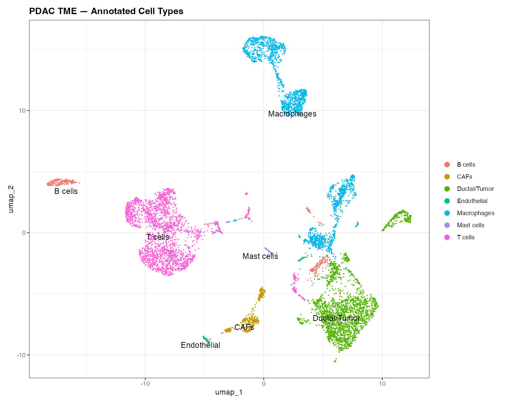
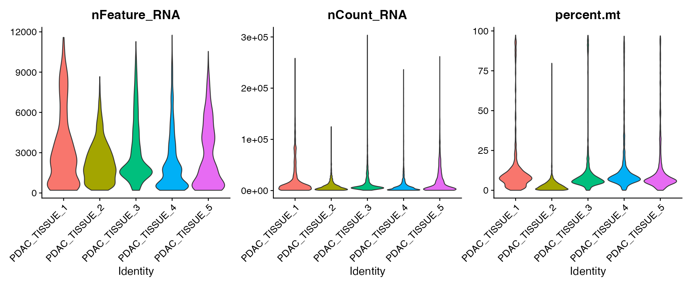
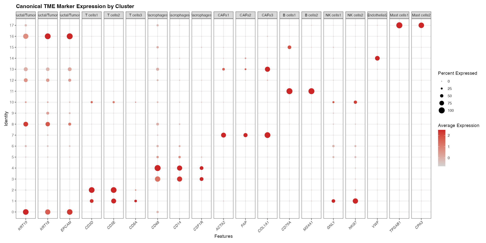

# scRNA-seq Analysis of Pancreatic Ductal Adenocarcinoma TME

# Overview
Single-cell RNA-seq analysis of the pancreatic ductal adenocarcinoma (PDAC) 
tumor microenvironment using the Seurat framework. This project explores 
cell type composition, clustering, and transcriptional heterogeneity 
in the TME using publicly available data (GSE155698).

# Objectives
- Perform quality control and preprocessing of scRNA-seq data
- Identify and annotate distinct cell populations in the PDAC TME
- Visualize transcriptional landscape using UMAP
- Perform differential expression analysis across cell clusters

## Data Source
Data downloaded from NCBI GEO: 
[GSE155698](https://www.ncbi.nlm.nih.gov/geo/query/acc.cgi?acc=GSE155698)

## Tools & Packages
R, Seurat, ggplot2, tidyverse, SingleR, clusterProfiler

## Repository Structure
- `scripts/` — R analysis scripts, numbered in order of execution
- `results/figures/` — all generated plots and visualizations
- `data/` — not tracked (see Data Source above to download)

## Results
### Annotated Cell Types — PDAC TME

### QC Metrics Before Filtering

### Canonical TME Marker Expression

## Author
Simran Randhawa | MS Student, Johns Hopkins Bloomberg School of Public Health  
[LinkedIn](https://www.linkedin.com/in/simranrandhawa20)
