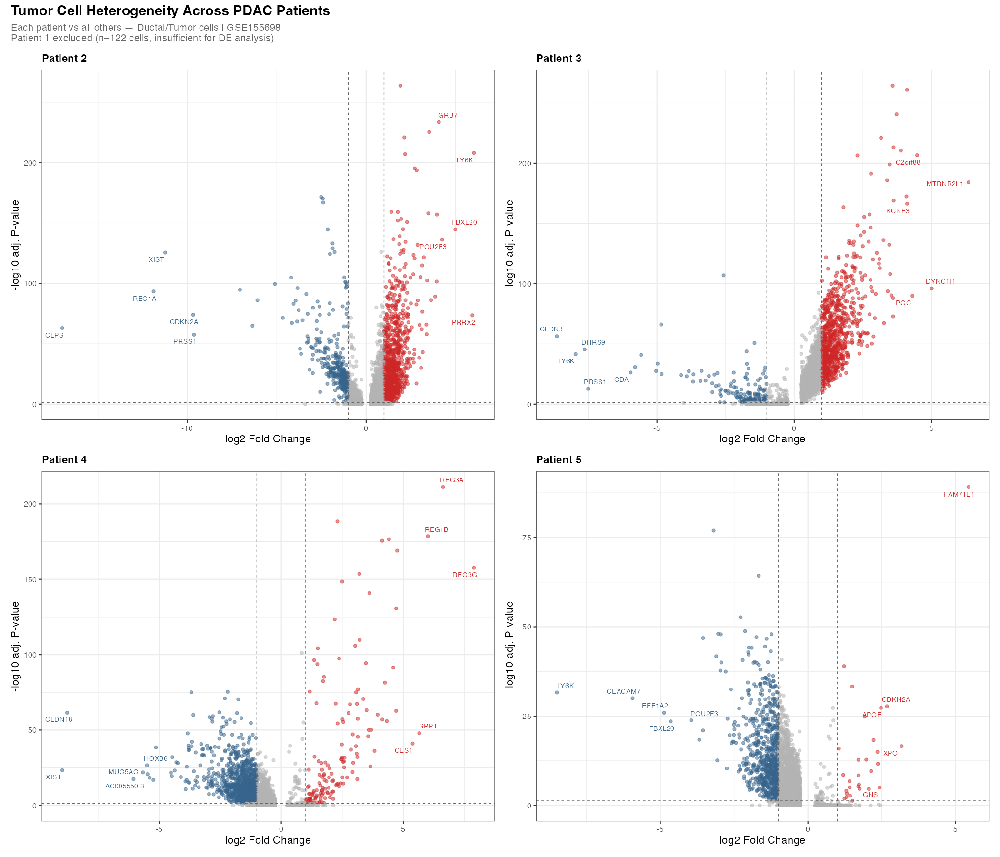

# scRNA-seq Analysis of Pancreatic Ductal Adenocarcinoma TME

# Overview
Single-cell RNA-seq analysis of the pancreatic ductal adenocarcinoma (PDAC) 
tumor microenvironment using the Seurat framework. This project explores 
cell type composition, clustering, and transcriptional heterogeneity 
in the TME using publicly available data (GSE155698).

# Objectives
- Perform quality control and preprocessing of scRNA-seq data
- Identify and annotate distinct cell populations in the PDAC TME
- Visualize transcriptional landscape using UMAP
- Perform differential expression analysis across cell clusters

## Data Source
Data downloaded from NCBI GEO: 
[GSE155698](https://www.ncbi.nlm.nih.gov/geo/query/acc.cgi?acc=GSE155698)

## Tools & Packages
R, Seurat, ggplot2, tidyverse, SingleR, clusterProfiler

## Repository Structure
- `scripts/` — R analysis scripts, numbered in order of execution
- `results/figures/` — all generated plots and visualizations
- `data/` — not tracked (see Data Source above to download)

## Results
### QC Metrics Before Filtering

### Canonical TME Marker Expression

### Annotated Cell Types — PDAC TME

### Patient Tumor Cell Heterogeneity

## Key Findings
**Distinct TME cell populations identified: Seven major cell types were 
annotated in the PDAC tumor microenvironment — ductal/tumor cells, T cells, 
macrophages, CAFs, B cells, endothelial cells, and mast cells based on 
canonical marker expression (KRT19/EPCAM for tumor, CD3D for T cells, 
CD68/CD14 for macrophages, ACTA2/COL1A1 for CAFs).

**Macrophages are the dominant immune population: The largest immune 
cluster by cell number was macrophages, consistent with the known 
immunosuppressive microenvironment characteristic of PDAC.

**Well-separated stromal and immune compartments: UMAP embedding shows 
clear separation between stromal (CAFs, endothelial), immune (T cells, 
macrophages, B cells), and tumor (ductal/tumor) populations, suggesting 
transcriptionally distinct compartments in the TME.

**Inter-patient tumor cell heterogeneity: Differential expression 
analysis of ductal/tumor cells across patients reveals patient-specific 
transcriptional signatures. Patient 4 shows upregulation of REG3A and REG3B 
relative to other patients; these genes have been associated with pancreatic 
stress responses and acinar cell identity, though their specific role in this 
patient's tumor requires further investigation.

## Author
Simran Randhawa | MS Student, Johns Hopkins Bloomberg School of Public Health  
[LinkedIn](https://www.linkedin.com/in/simranrandhawa20)
